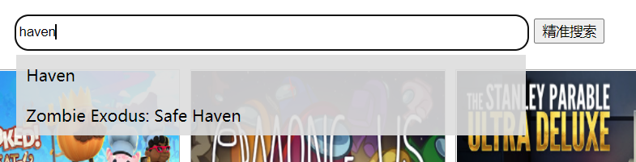
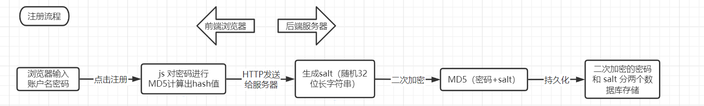
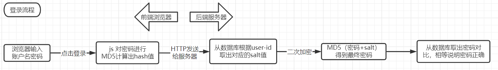
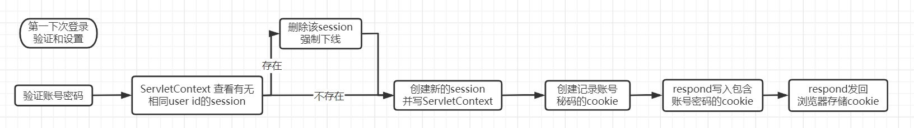
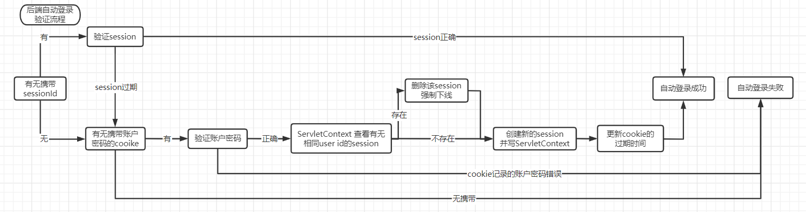
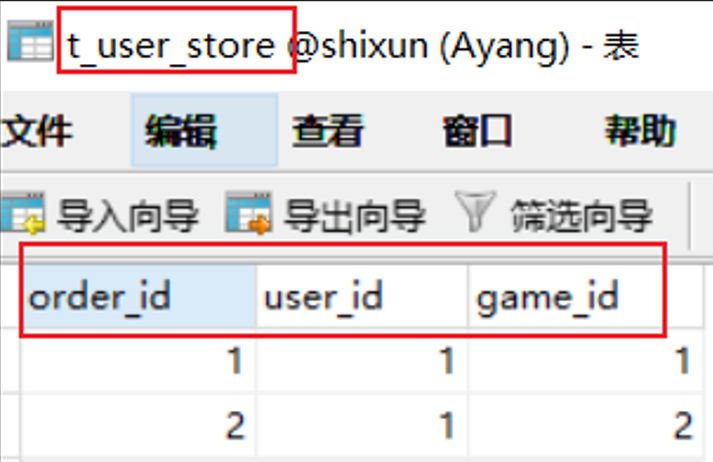

### 项目整体概括

>1. 项目使用**前后端分离**开发方式，利用**ajax**发送异步请求，以**json**交互数据
>2. 密码使用**MD5+盐**的方式进行传输和存储，不使用明文密码
>3. 运用**cookie和session**进行用户**登录状态管理**，运用**ServletContext**存储全局用户登录信息，**HttpSessionListener**监听**session**并利用**ServletContext**管理用户登录信息：（1）实现**7天自动登录**；（2）实时监视**网站登录总人数**；（3）不允许一个账号同时在不同浏览器登录，实现一方登录，另一方**强制下线**功能。
>4. 运用**session**实现**购物车**
>5. 运用**filter**进行过滤请求，防止未登录用户访问需要登录的页面和获取登录后的信息等非法访问
>6. 数据库封装**BaseDao**类：（1）运用apache的**dbutils**工具类；（2）运用阿里的**Druid连接池**；（3）数据库**可选择是否开启事务**，配合**ThreadLocal+filter**进行一个请求线程内的事务管理。
>7. 前端使用**jquery+ajax**进行**实时交互渲染**。例：游戏**搜索功能**的实现，动态显示。
>8. **分页功能**的实现和其**可变性**

### 1. 前后端分离（ajax）

搜索模块进行讲解

### 2. 登录注册 

**MD5 消息摘要算法**，一种被广泛使用的密码散列函数，可以产生出一个128位（16字节）的散列值（hash value），用于确保信息传输完整一致。其典型应用就是对一段信息产生信息摘要，防止被篡改。

1. **抗修改性**：对原数据进行任何改动，哪怕只修改1个字节，所得到的MD5值都有很大区别。

2. **不是加密算法**，理论是不能解密的，但是彩虹表，字典等可破解常见密码。解决方案：通过**加salt**。

3. 加**随机salt**：每个密码单独加一个**随机字符串**，再进行MD5。大大提高安全性。

### 3. 登录状态管理

#### (1) 第一次登录

#### (2) 自动登录例子

每次打开页面会发送ajax请求进行自动登录验证，验证成功则自动登录

#### (3) 监视网站实时登录人数

1. **ServletContext**储存用户登录表，记录user_id和对应的**session**

2. session超时**自动销毁**或**强制销毁**（重复登录），**HttpSessionListener**监听session销毁并从用户登陆表移除

### 4. 购买、购物车、个人仓库展示

1. session实现购物车
2. 购买会先看购物车有无，有则删除购物车中的物品（实际演示）
3. 数据库实现个人仓库

### 5. 数据库讲解

#### (1) 用户游戏仓库设计

游戏和用户属于**多对多关系**，用**三张表存储**，---用户表、游戏表、用户游戏表---

1. **关系型数据库**不适合存储这种信息，一般用**文档型数据库**（例：MongoDB，value可以是各种数据结构（list等）

2. **关系型数据库**：二维表结构
3. **文档型数据库**——这些数据库通常将每个键与称为文档的复杂数据结构配对，也就是说value可以是各种数据结构，可以实现变化存储。

#### (2) ThreadLocal + Filter 进行事务管理 （可选择是否开启事务）

1. **ThreadLocal**是解决线程安全问题一个很好的思路，它通过为每个线程提供一个独立的变量副本解决了变量并发访问的冲突问题。

   该类提供了线程局部 (thread-local) 变量。这些变量不同于它们的普通对应物，因为访问某个变量(通过其 get 或 set 方法)的每个线程都有自己的局部变量，它独立于变量的初始化副本。

2. **Tomacat**（多线程） 对于每一个请求都会开启一个**新的线程**来处理（运用线程池），故可用ThreadLocal 来进行事务管理，使一个请求里的**Conection是同一个**。

#### (3) Filter 进行请求过滤

1. 前端会验证是否存在sessionid ，存在则发送请求，不存在则跳到登录页面

2. 规定请求包含用户信息的请求都携带**/user/**，后端 Filter 对 /user/ 进行session验证，判断是否处于登录状态，是则放行。

3. 后端的过滤，能有效避免跳过前端验证直接手动发送请求恶意获取信息的方式。

### 6. 分页功能实现（实际演示）